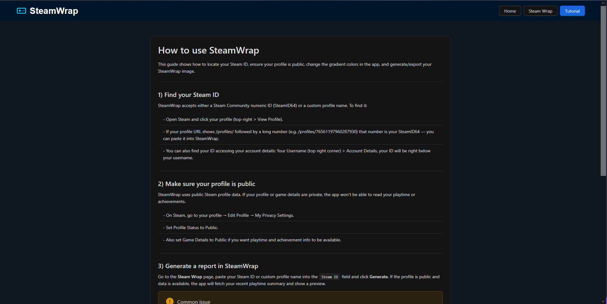

# SteamWrap

SteamWrap is a small React + TypeScript app (Vite) that generates a shareable Steam "wrap" image for a user using Steam Web API data and server-side image generation (node-canvas). The app fetches user data from the Steam Web API and creates an image that can be shared on social media or in other contexts.

## Quick start
These commands assume you have Node.js and npm installed.

1) Install dependencies

```powershell
npm install
```

2) Add local environment variables (create a `.env` in project root, DO NOT commit)

There is an example file included at `.env.example`. Copy it to `.env` and fill in your keys.

Example `.env` for local development (also provided in `.env.example`):

```
VITE_STEAM_API_KEY=your_steam_api_key_here  
```

3) Start the frontend dev server

```powershell
npm run dev
# opens a Vite dev server (usually on http://localhost:5173)
```

**⚠️ Warning:** This application was not made to be deployed. It is intended for local use only. Developed just for fun, learning purposes and personal desire for cool Steam Wrap images.

## Application Showcase
The **home page** showcases the main features of SteamWrap, explaining the application could be a nice service for Steam users to generate shareable images of their gaming stats.


The **Steam wrap page** allows users to input their Steam ID, fetches their data from the Steam Web API, select desired colors for the gradient and generates a wrap image.


The **tutorial page** provides a step-by-step guide on how to use the application effectively. Explaining how to obtain your Steam ID, make you profile public, customize the wrap, and share it.



Here is some example generated Steam wrap images:
<div>


</div>